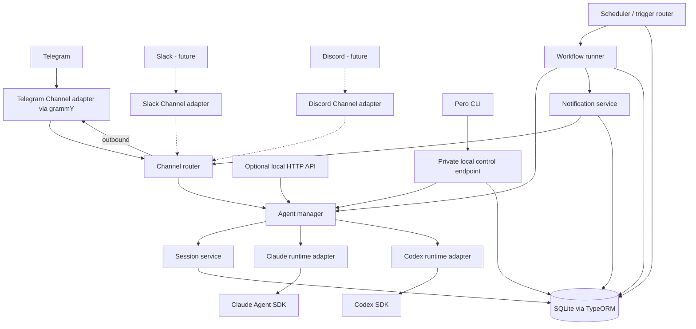

# Pero architecture

## 1. Purpose and scope

Build Pero as a personal, self-hosted runtime that accepts conversation through Channels and performs background work through configured Agents. Telegram is the first Channel integration; one Telegram topic is one Channel. A single installation serves one owner. The architecture leaves room for Slack, Discord, and other communication integrations later.

**Initial deployment:** one globally installed `pero` CLI, one background NestJS service, and one SQLite database on persistent local storage. `pero run` starts the service; `pero stop` stops it; management commands such as `pero agents ls` use the same application services. No mandatory PostgreSQL, Redis, external queue, or workflow engine. See the [CLI contract](./CLI.md).

## 2. Domain vocabulary

| Concept | Meaning | Initial behavior |
|---|---|---|
| **Agent** | A saved definition of behavior: instructions, provider and provider options (model, effort), working directory, and allowed tools. | `assistant`, `reforma`, or `health` are examples. An Agent definition is not a running process. |
| **Agent Runtime** | Adapter that executes an Agent using a provider SDK and normalizes the result. | `ClaudeRuntime` uses Claude Agent SDK; `CodexRuntime` uses Codex SDK. |
| **Channel** | A transport-independent conversation endpoint assigned to one active Agent. | The first integration is Telegram: one topic maps to one Channel. Future adapters can map Slack threads, Discord channels, or other endpoints to Channels. |
| **Session** | Persistent conversational context for a Channel and Agent, including the provider's session/thread ID. | Interactive turns continue the same Session until reset or Agent reassignment. |
| **Workflow** | Saved definition of autonomous work: Agent, input, trigger, execution policy, and notification destinations. | A Workflow definition can have many Workflow Runs. |
| **Trigger** | Rule or signal that starts a Workflow. | `schedule` and `manual` first; `webhook` and `event` fit the same contract later. |
| **Event** | Normalized fact emitted by the runtime or a communication integration. | Examples: `telegram.message.received`, `workflow.run.completed`. Events need not be a separately persisted event-sourcing log. |
| **Tool** | Capability granted to a runtime execution. | Filesystem, shell, browser, or external service, controlled per Agent and execution context. |
| **Notification** | Outbound message produced outside a direct chat reply. | A Workflow may send one to a configured Channel. |

Each Channel record names its integration (`telegram` initially) and holds a provider-specific address behind the Channel boundary. Telegram's address contains `chat_id` and `message_thread_id`; a topic is a Channel instance, not a separate domain type. Slack and Discord adapters can supply their own address types later without changing Agents, Sessions, or Workflows. See the [Telegram Bot API](https://core.telegram.org/bots/api) for topic routing fields.

A **Channel** is a saved conversation endpoint; a **Channel adapter** connects that endpoint to a communication service. The adapter normalizes incoming identity, text, and attachments, and sends replies or Notifications to its own address type. For example, Telegram uses a chat/topic pair, while a future Slack adapter may use workspace/channel/thread identifiers. The rest of the runtime routes by `channel_id`.

### Agent configuration and defaults

An Agent owns three execution choices: `provider` (`claude` or `codex`), `providerOptions` (the options for that provider: `model`, a provider-specific model name, and `effort`, from that provider's own set of levels; each is null for the provider's default), and `workingDirectory` (the folder passed to the SDK). Instructions and tool policy belong to the same Agent. Channels choose an Agent; Workflows reference an Agent; neither needs to duplicate these execution settings.

Pero also keeps installation defaults in the SQLite `settings` record, managed through the CLI: a default provider, `provider_defaults` (options for each provider), a default working directory, and shared instructions. `provider_defaults` is JSON validated by one Zod schema per provider, so a new option or provider needs no migration; a missing value means the provider default. Provider and provider options are creation templates: creating an Agent copies the selected provider and its options into the Agent record, and changing them later affects future Agents only. When changing an Agent's provider, choose options for that provider, prefilled from its defaults. A null option tells the adapter to omit the corresponding SDK option, so the provider chooses its default when a new Session starts.

**Working directory.** Several Agents often work on the same data, for example an Assistant, a Health, and a Finance Agent that all edit one Obsidian vault. So all Agents use one shared folder, `settings.default_working_directory`, unless the owner explicitly gives an Agent its own absolute folder. Pero never creates per-Agent folders on its own. The default is a live setting rather than a creation template: an Agent without its own folder always resolves to the current default.

Setup fills the default. The interactive first `pero run` proposes the folder the CLI was started from; if that is the owner's home directory, it proposes `~/workspace` instead. The owner accepts it or enters another absolute folder, and Pero creates it if missing. Until a default is set, creating an Agent without its own folder is rejected with a hint to set one. Once set, the default can be changed but not cleared, so an Agent that follows it always has a folder.

Changing the default moves every Agent that follows it, so the change increments those Agents' `execution_config_version` in the same transaction and their Sessions rotate like any other execution-setting edit. The version increases only when the effective setting actually changes: saving the same folder, or giving an Agent its own folder equal to the default it followed, rotates nothing. Validate that a folder is absolute, resolves to the intended location, and is readable and writable by the service account before it is saved as the default or on an Agent. The working directory establishes project context; tool permissions and sandboxing govern file access separately.

**Shared instructions.** Agents serve different goals but can share a personality. `settings.shared_instructions` holds text that Pero places before each Agent's own `instructions` when it builds a runtime request; an Agent can opt out with `use_shared_instructions = false`. Instruction edits, shared or per-Agent, are not execution settings and do not rotate Sessions.

## 3. System boundaries



**Boundary rule:** Channel integrations normalize inbound messages into a common Channel message and deliver outbound replies/Notifications through a common adapter contract. Channels and Workflows invoke `AgentManager`; they do not import agent SDKs. Only `runtimes/claude` and `runtimes/codex` translate to agent SDK APIs. `AgentManager` selects the execution adapter, applies Agent configuration and tool policy, and translates provider events into runtime events/results.

The CLI is a local control surface for the same domain services. Agent, Channel, Workflow, and Trigger definitions remain in SQLite as the source of truth. A private owner-only endpoint lets CLI commands reach the running process, so edits can validate references and rotate affected Sessions. The daemon is the only process that opens SQLite; management commands require it to be running, and it starts in a degraded state rather than failing when Telegram or provider settings are missing or invalid. Do not maintain a second live copy of definitions in JSON files.

The Channel adapter contract needs operations equivalent to `start(onMessage)` and `send(address, message)`. The normalized inbound message includes integration kind, external address, external message and sender IDs, content, and attachments. The Channel router resolves that address to `channel_id`, applies authorization, then passes the content to `AgentManager`. Provider-specific objects stay inside their adapter.

## 4. Suggested NestJS modules

| Module | Owns | Depends on |
|---|---|---|
| `AgentsModule` | Agent definitions, `AgentManager`, runtime selection | Sessions, Runtimes, Tools |
| `ControlModule` | Owner-only local CLI command endpoint and lifecycle requests | Application services, Persistence |
| `RuntimesModule` | Runtime interface and Claude/Codex adapters | SDKs, Tools |
| `ChannelsModule` | Channel lookup, normalized inbound/outbound contracts, integration selection | Agents, Sessions |
| `TelegramModule` | First Channel adapter: grammY update intake and Telegram delivery | Channels |
| `SessionsModule` | Interactive context lifecycle and provider ID mapping | Persistence |
| `WorkflowsModule` | Workflow definitions, runs, runner, results | Agents, Notifications, Persistence |
| `TriggersModule` | Schedule/manual trigger normalization; later webhook/event adapters | Workflows |
| `SchedulerModule` | Polling due schedules and startup recovery | Triggers, Persistence |
| `NotificationsModule` | Durable delivery requests, retry state, channel delivery | Channels, Persistence |
| `ToolsModule` | Tool catalog and permission policy | Configuration |
| `PersistenceModule` | TypeORM entities, migrations, transactions | SQLite |

Avoid module cycles by depending on narrow service interfaces where needed. An internal application event dispatcher can connect completion events to notifications without making an event broker a deployment requirement.

## 5. Runtime contract

Pero owns `AgentId`, `SessionId`, and `WorkflowRunId`. Provider IDs are opaque strings stored alongside them. A conceptual interface is:

```ts
interface AgentRuntime {
  readonly kind: 'claude' | 'codex';
  execute(request: RuntimeRequest): AsyncIterable<RuntimeEvent>;
  cancel(executionId: string): Promise<void>;
}

interface RuntimeRequest {
  agentId: string;
  input: string;
  instructions: string; // shared instructions (unless opted out) + the Agent's own
  providerOptions: ProviderOptions; // model, effort; null values are omitted
  workingDirectory: string; // effective folder, already resolved
  providerSessionId?: string; // absent for a new conversation
  toolPolicy: ToolPolicy;
  signal: AbortSignal;
}
```

The adapter returns a newly created or resumed provider session ID in a normalized event. `AgentManager` persists that mapping before accepting the next turn. Normalize text deltas, tool activity, final result, errors, and cancellation. Keep raw provider payloads behind the adapter boundary; store only what is needed for diagnostics and recovery. The interface is a design contract, not a claim that the two SDKs have identical APIs.

**Session policy:** one active interactive Session per `(channel_id, agent_id)` in v1. On Agent reassignment, close the old Session and create a new one. Changing an Agent's provider, provider options, or effective working directory (including a change to the default folder it follows) also closes its active Sessions; the next turn starts with the new configuration. Active executions finish with the configuration captured when they started. Workflow Runs use an isolated provider session or a stateless execution by default, so scheduled work does not change the Channel's conversation history. A Workflow may explicitly opt into a dedicated reusable workflow Session later.

## 6. Core flows

### Interactive Telegram message

1. grammY receives an update. Verify the sender/chat allowlist, ignore bot-originated loops, and deduplicate by Telegram update ID.
2. Resolve the Channel from `integration_kind='telegram'` and an external key derived from `(chat_id, message_thread_id)`. If unknown, follow the configured enrollment policy; do not silently route to an arbitrary Agent.
3. Load the Channel's assigned Agent and active Session. Serialize turns within that Session to preserve conversation order; turns for other Sessions and Agents may run at the same time, even in the same folder.
4. `AgentManager` invokes the selected Runtime with the Session's provider ID and the Agent's provider options, effective working directory, composed instructions, and tool policy.
5. Persist the returned provider session ID and turn outcome. Send the reply back to the same Telegram topic.
6. Record errors and send a concise failure message when appropriate. A direct reply is not a Notification record unless durable delivery is required.

### Background Workflow

1. A Trigger produces a normalized `WorkflowTrigger` with a stable deduplication key.
2. In one database transaction, create a `pending` Workflow Run and advance the schedule's `next_run_at` (for schedule triggers). Enforce uniqueness on the trigger key.
3. Wake the bounded in-process executor. It claims a pending run and changes it to `running`.
4. `WorkflowRunner` invokes `AgentManager` in an isolated execution context and records the result or error.
5. In one transaction, mark the execution `completed`, `failed`, `cancelled`, or `interrupted` and create any required Notification records. Notification delivery has its own status and does not keep a completed execution in `running`.
6. Dispatch pending Notifications independently and record delivery outcomes.

```text
Trigger -> WorkflowRun(pending) -> executor -> AgentManager -> Runtime
                                            -> result -> Notification -> Channel
```

## 7. Persistence model

Use relational columns for stable relationships and states. Use JSON only for versioned provider-specific configuration, event payloads, or result metadata that does not justify a table yet.

| Table | Essential fields and constraints |
|---|---|
| `settings` | Singleton row for installation defaults (`default_provider`, `provider_defaults` JSON with each provider's options, `default_working_directory` nullable, `shared_instructions` nullable), timezone, and operational limits. Change through validated CLI commands. |
| `agents` | `id`, `name` (slug), `title` (optional display name), `provider`, `instructions`, `provider_options` (JSON, validated for `provider`; null values mean the provider default), `working_directory` (resolved absolute path; null follows the default), `use_shared_instructions` (true by default), `codex_skip_git_repo_check` (false by default), `tool_policy_json`, `execution_config_version`, `enabled`, timestamps. Unique name. Increment the version when provider, provider options, or effective directory changes. |
| `channels` | `id`, `integration_kind`, `external_key`, `address_json`, `agent_id`, `enabled`, timestamps. Unique `(integration_kind, external_key)`. For Telegram, derive the key from `chat_id` and the normalized `message_thread_id`; keep the structured IDs in `address_json`. |
| `sessions` | `id`, `agent_id`, `channel_id`, `provider_session_id`, `agent_config_version`, `status`, timestamps. A partial unique index on `(channel_id, agent_id)` where `status = 'active'` allows one active Session and serves the lookup; resume only if the saved version matches the Agent. |
| `workflows` | `id`, `name` (slug), `title` (optional display name), `agent_id`, `input_template`, `enabled`, `concurrency_policy`, timestamps. Unique name. |
| `triggers` | `id`, `workflow_id`, `kind`, `config_json`, `timezone`, `next_run_at`, `last_run_at`, `enabled`. Index `(enabled, next_run_at)` for schedules. |
| `workflow_runs` | `id`, `workflow_id`, `trigger_id`, `trigger_key`, `status`, `attempt`, `execution_config_json` (provider, provider options, resolved working directory snapshot), `created_at`, `started_at`, `finished_at`, `result_json`, `error_text`. Unique `(workflow_id, trigger_key)`; index `(status, created_at)`. |
| `workflow_notification_targets` | `workflow_id`, `channel_id`, optional delivery rule. Composite primary key. |
| `notifications` | `id`, `workflow_run_id`, `channel_id`, `status`, `payload`, `attempt`, `next_attempt_at`, `provider_message_id`, timestamps. Index delivery state; unique `(workflow_run_id, channel_id)`, widened with a notification kind if one message of each kind is needed. |
| `inbound_updates` | `integration_kind`, `external_update_id`, `received_at`, processing state. Unique integration/update ID; retain only as long as needed for deduplication. |

Rows use integer IDs that SQLite never reuses; the CLI also addresses Agents and Workflows by unique name. A name is a slug (lowercase letters and digits in words joined by single hyphens, at most 64 characters), so it never needs quoting and cannot differ from another only by case. Input is lowercased before it is checked. An optional title holds any display text. Records that history refers to (Agents, Channels, Workflows) cannot be deleted while referenced; the CLI disables them instead. Rows a Workflow or run owns (Triggers, notification targets, Notifications) are deleted along with it, and removing a Trigger keeps its runs with no trigger. Columns a later feature needs, such as a notification target's delivery rule, arrive with that feature's migration.

Define explicit migrations and disable production schema synchronization. Store timestamps in UTC; retain the trigger's IANA timezone for computing future occurrences. Store Telegram IDs as strings or safe 64-bit values to avoid JavaScript number precision assumptions.

## 8. Scheduling and recovery

`@nestjs/schedule` can run a short polling tick (for example, every 10 seconds). The tick reads due `schedule` Triggers from SQLite. It is **not** the authoritative schedule: persisted `next_run_at` is. On restart, overdue rows are found again and turned into pending runs. Compute the next occurrence using the saved timezone and an explicit daylight-saving policy. Define whether missed intervals are coalesced into one run or replayed; v1 should coalesce to one catch-up run per Trigger and record the skipped interval count.

SQLite is the durable work ledger. The memory queue only limits active executions. At startup, load `pending` runs and inspect `running` runs. A run found `running` after an unclean stop becomes `interrupted`; retry only if its policy permits it. Tool side effects and Telegram delivery can occur before a crash is recorded, so execution is **at least once**, not exactly once. Use the trigger key to prevent duplicate run creation, and use idempotency keys or reconciliation for external side effects. Do not automatically replay an interrupted run that may have made irreversible changes unless that Workflow opts in.

For one process, claim and state changes can use short SQLite transactions. Do not hold a transaction while an agent runs. Bound total concurrency, serialize turns within a Session, and allow one active run per Workflow. Different Agents may run at the same time in a shared folder: they usually touch different notes, and when two edit the same file the last write wins. A per-folder exclusive option can be added if that proves a problem. Graceful shutdown stops intake, halts new claims, requests cancellation, waits a bounded period, and leaves unresolved runs for startup recovery.

## 9. Events, tools, and notifications

Events are typed application facts with `type`, `occurredAt`, `source`, `correlationId`, and payload. Start with an in-process dispatcher. Persist business state and any delivery obligation first; publishing an in-memory event alone must never be the only record of a required Workflow Run or Notification. Add an outbox if more integrations need reliable asynchronous event delivery.

Tools are capabilities granted by policy. An Agent definition lists permitted tools, and the Runtime adapter maps that list to provider controls. A working directory is the starting context, not a filesystem security boundary; use provider permissions and sandbox settings where file access must be constrained. Keep secrets in configuration/secret storage rather than prompts or database rows. Treat external text and tool output as untrusted input. Apply owner/chat authorization before a Telegram message can reach an Agent.

Notifications are durable outbound delivery requests. Each targets a Channel, carries a rendered payload, and records attempts and provider message ID. Failed delivery stays visible for retry; successful delivery is terminal. Keep reply routing and background notification routing separate so a workflow cannot accidentally overwrite an interactive Session.

## 10. Scaling path

Scale only when a measured bottleneck warrants it:

1. Tune execution concurrency, per-Session serialization, and SQLite indexes within the single process.
2. Separate Telegram/API intake from worker execution if responsiveness or crash isolation requires it. At that point, replace the in-memory wakeup with a cross-process dispatcher and define a single schedule owner.
3. Move durable state to PostgreSQL when multiple writers or hosts require it. Migrate through repository interfaces and tested data migrations.
4. Add Redis/BullMQ or another broker when distributed workers, queue throughput, or advanced retry coordination justify it. Keep the Workflow definition and Agent Runtime contracts stable.
5. Add a heavier workflow engine only for long-lived, multi-step orchestration that needs durable waits and human approvals.

SQLite WAL is designed for readers and a writer on the same machine; it is not a shared database for multiple hosts. See the [SQLite WAL documentation](https://www.sqlite.org/wal.html).
