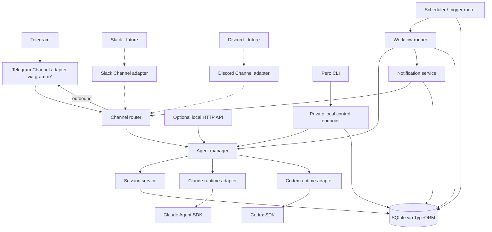

# Pero architecture

## 1. Purpose and scope

Build Pero as a personal, self-hosted runtime that accepts conversation through Channels and performs background work through configured Agents. Telegram is the first Channel integration; each topic of the owner's Telegram group is one Channel, as are the group's General topic and a direct chat with the bot. A single installation serves one owner. The architecture leaves room for Slack, Discord, and other communication integrations later.

**Initial deployment:** one globally installed `pero` CLI, one background NestJS service, and one SQLite database on persistent local storage. `pero run` starts the service; `pero stop` stops it; management commands such as `pero agents ls` use the same application services. No mandatory PostgreSQL, Redis, external queue, or workflow engine. See the [CLI contract](./CLI.md).

## 2. Domain vocabulary

| Concept | Meaning | Initial behavior |
|---|---|---|
| **Agent** | A saved definition of behavior: instructions, provider and provider options (model, effort), working directory, and allowed tools. | `assistant`, `reforma`, or `health` are examples. An Agent definition is not a running process. |
| **Agent Runtime** | Adapter that executes an Agent using a provider SDK and normalizes the result. | `ClaudeRuntime` uses Claude Agent SDK; `CodexRuntime` uses Codex SDK. |
| **Channel** | A transport-independent conversation endpoint assigned to one active Agent. | The first integration is Telegram: one topic, the General topic, or a direct chat maps to one Channel. A new topic onboards a new Agent. Future adapters can map Slack threads, Discord channels, or other endpoints to Channels. |
| **Session** | Persistent conversational context for a Channel and Agent, including the provider's session/thread ID. | Interactive turns continue the same Session until reset or Agent reassignment. |
| **Message** | One text message exchanged in a Channel: in from a person, or out from an Agent, Pero, or a Workflow Notification. | Recorded per Channel as its history. Not the provider's transcript: no reasoning or tool activity. |
| **Workflow** | Saved definition of autonomous work: Agent, input, trigger, execution policy, and notification destinations. | A Workflow definition can have many Workflow Runs. |
| **Trigger** | Rule or signal that starts a Workflow. | `schedule` and `manual` first; `webhook` and `event` fit the same contract later. |
| **Event** | Normalized fact emitted by the runtime or a communication integration. | Examples: `telegram.message.received`, `workflow.run.completed`. Events need not be a separately persisted event-sourcing log. |
| **Tool** | Capability granted to a runtime execution. | Filesystem, shell, browser, or external service, controlled per Agent and execution context. |
| **Notification** | Outbound message produced outside a direct chat reply. | A Workflow may send one to a configured Channel. |

Each Channel record names its integration (`telegram` initially) and holds a provider-specific address behind the Channel boundary. Telegram's address contains `chat_id` and, for a topic, `message_thread_id`; the General topic, a group without topics, and a direct chat have no topic ID. A topic is a Channel instance, not a separate domain type. Slack and Discord adapters can supply their own address types later without changing Agents, Sessions, or Workflows. See the [Telegram Bot API](https://core.telegram.org/bots/api) for topic routing fields.

A **Channel** is a saved conversation endpoint; a **Channel adapter** connects that endpoint to a communication service. The adapter normalizes incoming identity, text, and attachments, and sends replies or Notifications to its own address type. For example, Telegram uses a chat/topic pair, while a future Slack adapter may use workspace/channel/thread identifiers. The rest of the runtime routes by `channel_id`.

### Telegram chats, topics, and onboarding

The recommended setup is one private group used as a workspace: the owner creates a bot with BotFather, creates a group, enables topics, adds the bot as an administrator, and allows the group's chat ID on the host with `pero telegram allow`. Administrator rights matter because Telegram otherwise delivers only commands, mentions, and replies to a bot in a group; the bot needs no specific right. A direct chat with the bot is also supported: the owner allows their own user ID, which is that chat's ID.

Authorization is per chat. `allowed_chats` lists the chats Pero serves; anyone who can post in an allowed group may reach its Agents, so group membership is the owner's control. A chat that is not allowed never reaches an Agent: its messages get a rate-limited pairing hint naming the chat ID and the `pero telegram allow` command. Chats are allowed only through the CLI on the host, never from a Telegram message. Enabling topics converts a basic group into a supergroup with a new chat ID; the adapter follows `migrate_to_chat_id` and moves the allowlist entry and Channel keys.

Channels are created by onboarding, not by manual enrollment. When a topic is created in an allowed chat, Pero creates an Agent named after the topic (a slug of its title with accents dropped and Cyrillic spelled in Latin letters, made unique, or `topic-<id>` when nothing is left) with the installation defaults, assigns it to the new Channel, and posts a welcome in the topic. A first message in a Channel Pero does not know yet onboards it the same way and then goes on to its Agent. The chat's primary Channel (the General topic, a group without topics, or a direct chat) is assigned the **main Agent**, named by `settings.main_agent_id` and created as `main` on first use, so a General topic and a direct chat share one Agent with separate Sessions. The owner can point any Channel at another Agent with `pero channels assign`; onboarding never changes an existing assignment.

### Agent configuration and defaults

An Agent owns three execution choices: `provider` (`claude` or `codex`), `providerOptions` (the options for that provider: `model`, a provider-specific model name, and `effort`, from that provider's own set of levels; each is null for the provider's default), and `workingDirectory` (the folder passed to the SDK). Instructions and tool policy belong to the same Agent. Channels choose an Agent; Workflows reference an Agent; neither needs to duplicate these execution settings.

Pero also keeps installation defaults in the SQLite `settings` record, managed through the CLI: a default provider, `provider_defaults` (options for each provider), a default working directory, and shared instructions. `provider_defaults` is JSON validated by one Zod schema per provider, so a new option or provider needs no migration; a missing value means the provider default. Provider and provider options are creation templates: creating an Agent copies the selected provider and its options into the Agent record, and changing them later affects future Agents only. When changing an Agent's provider, choose options for that provider, prefilled from its defaults. A null option tells the adapter to omit the corresponding SDK option, so the provider chooses its default for that turn.

**Working directory.** Several Agents often work on the same data, for example an Assistant, a Health, and a Finance Agent that all edit one Obsidian vault. So all Agents use one shared folder, `settings.default_working_directory`, unless the owner explicitly gives an Agent its own absolute folder. Pero never creates per-Agent folders on its own. The default is a live setting rather than a creation template: an Agent without its own folder always resolves to the current default.

Setup fills the default. The interactive first `pero run` proposes the folder the CLI was started from; if that is the owner's home directory, it proposes `~/workspace` instead. The owner accepts it or enters another absolute folder, and Pero creates it if missing. Until a default is set, creating an Agent without its own folder is rejected with a hint to set one. Once set, the default can be changed but not cleared, so an Agent that follows it always has a folder.

Changing the default moves every Agent that follows it: each resolves its folder when a turn starts, so the next turn runs in the new default, in a fresh Session (see the Session policy in §5). Validate that a folder is absolute, resolves to the intended location, and is readable and writable by the service account before it is saved as the default or on an Agent. The working directory establishes project context; tool permissions and sandboxing govern file access separately.

**Shared instructions.** Agents serve different goals but can share a personality. `settings.shared_instructions` holds text that Pero places before each Agent's own `instructions` when it builds a runtime request; an Agent can opt out with `use_shared_instructions = false`. Instruction edits, shared or per-Agent, apply from the next turn and keep the Session.

## 3. System boundaries



**Boundary rule:** Channel integrations normalize inbound messages into a common Channel message and deliver outbound replies/Notifications through a common adapter contract. Channels and Workflows invoke `AgentManager`; they do not import agent SDKs. Only `runtimes/claude` and `runtimes/codex` translate to agent SDK APIs. `AgentManager` selects the execution adapter, applies Agent configuration and tool policy, and translates provider events into runtime events/results.

The CLI is a local control surface for the same domain services. Agent, Channel, Workflow, and Trigger definitions remain in SQLite as the source of truth. A private owner-only endpoint lets CLI commands reach the running process, so edits can validate references and update in-memory routing and schedules. The daemon is the only process that opens SQLite; management commands require it to be running, and it starts in a degraded state rather than failing when Telegram or provider settings are missing or invalid. Do not maintain a second live copy of definitions in JSON files.

The Channel adapter contract is `start(handlers)`, `stop()`, `send(address, message)`, and `edit(address, messageId, message)`; a message may carry a row of buttons, and a press reaches the `onAction` handler, whose answer the adapter shows the presser (Telegram: callback queries, answered with `answerCallbackQuery`). The other handlers take normalized messages and channel events: a topic created or renamed, a chat migrated to a new ID, and the bot's membership changed. A normalized message includes the integration kind, the update ID used for deduplication, the chat (key, kind `private` or `group`, title, address), the Channel key, title, address and topic ID (none for the chat's primary Channel, whose key is the chat's own), the external message and sender IDs, and content (attachments later). The Channel router checks the chat against the allowlist, deduplicates the update, and resolves the Channel key to `channel_id`. It then records the message in the Channel's history and passes it to `AgentManager`, or goes to onboarding when the Channel is new. Onboarding also follows a migrated chat, moving its allowlist entry and primary Channel key to the new ID in one transaction. Provider-specific objects stay inside their adapter.

## 4. Suggested NestJS modules

| Module | Owns | Depends on |
|---|---|---|
| `DefinitionsModule` | `Definitions`, the read-only view of defaults, Agents, and Workflows runtime code reads; SQLite-backed for now | Persistence |
| `AgentsModule` | Agent definitions, `AgentManager`, runtime selection | Sessions, Runtimes, Tools |
| `ControlModule` | Owner-only local CLI command endpoint and lifecycle requests | Application services, Persistence |
| `RuntimesModule` | Runtime interface and Claude/Codex adapters | SDKs, Tools |
| `ChannelsModule` | Channel lookup, normalized inbound/outbound contracts, integration selection | Agents, Sessions |
| `TelegramModule` | First Channel adapter: grammY update intake and Telegram delivery | Channels |
| `SessionsModule` | Interactive context lifecycle and provider ID mapping | Persistence |
| `WorkflowsModule` | Workflow definitions, runs, runner, results | Agents, Notifications, Persistence |
| `TriggersModule` | Schedule/manual trigger normalization; later webhook/event adapters | Workflows |
| `SchedulerModule` | Schedule state, polling due schedules, and startup recovery | Definitions, Workflows, Persistence |
| `NotificationsModule` | Durable delivery requests, retry state, channel delivery | Channels, Persistence |
| `ToolsModule` | Tool catalog and permission policy | Configuration |
| `PersistenceModule` | TypeORM entities, migrations, transactions | SQLite |

Avoid module cycles by depending on narrow service interfaces where needed. An internal application event dispatcher can connect completion events to notifications without making an event broker a deployment requirement.

## 5. Runtime contract

Pero owns `AgentId`, `SessionId`, and `WorkflowRunId`. Provider IDs are opaque strings stored alongside them. A conceptual interface is:

```ts
interface AgentRuntime {
  readonly kind: 'claude' | 'codex';
  execute(request: RuntimeRequest): AsyncIterable<RuntimeEvent>; // throws RuntimeError
}

interface RuntimeRequest {
  input: string;
  instructions: string; // shared instructions (unless opted out) + the Agent's own
  providerOptions: ProviderOptions; // model, effort; null values are omitted
  workingDirectory: string; // effective folder, already resolved
  skipGitRepoCheck?: boolean; // Codex only: allow a folder outside Git
  providerSessionId?: string; // absent for a new conversation
  toolPolicy: ToolPolicy; // permissions: 'ask' | 'bypass'
  approve?: ToolApprover; // asks the owner about a tool; absent means deny
  signal: AbortSignal; // cancels the turn
}

type RuntimeEvent =
  | { type: 'session'; providerSessionId: string } // created or resumed
  | { type: 'text'; delta: string }
  | { type: 'tool'; name: string }
  | { type: 'result'; text: string };

// RuntimeError.kind: 'auth' | 'cancelled' | 'session_lost' | 'failed'
```

The adapter returns a newly created or resumed provider session ID in a normalized event. `AgentManager` persists that mapping before accepting the next turn. Normalize text deltas, tool activity, and the final result as events; a failure throws a `RuntimeError` whose kind says whether the provider is signed out, the turn was cancelled through its signal, the provider no longer has the conversation the turn tried to resume (`session_lost`), or it failed otherwise. Keep raw provider payloads behind the adapter boundary; store only what is needed for diagnostics and recovery. The interface is a design contract, not a claim that the two SDKs have identical APIs.

**Session policy:** one active interactive Session per `(channel_id, agent_name)` in v1. On Agent reassignment, close the old Session and create a new one. A Session records the provider and the effective working directory it began with, and a turn resumes it only while the Agent still has both. When either differs, the turn closes that Session and starts a fresh one: another provider cannot read the session ID, and a provider session belongs to its folder (Claude Code stores sessions per project folder, and a Codex thread carries its folder in its history). A change of the default folder an Agent follows counts, since the effective folder is what is compared. Model, effort, and instructions are not part of this check: like switching the model inside the Claude Code or Codex CLI, an edit applies from the next turn of the same conversation. No version counter is kept; the comparison happens when a turn starts, so changing a setting and changing it back before the next message keeps the Session. Active executions finish with the configuration captured when they started. When Pero stops, intake ends first; running turns get the shutdown timeout to finish and are then aborted through their signal, turns still queued never start, and each such Channel is told to send its message again. The provider session ID a turn already reported stays recorded. When a fresh Session replaces an earlier one in the same Channel (a changed provider or folder, or a reassigned Channel), its first turn starts with the Channel's latest messages from Pero's message history (§7), so the conversation carries over even to another provider; a resumed Session gets nothing extra. The provider keeps the conversation itself in its own store, which a restore on another machine may not bring back and which the provider may prune. When a turn that resumes a Session fails as `session_lost`, the turn closes that Session and runs once more in a fresh one that starts from the Channel's history; a turn that resumed nothing is never retried this way. Workflow Runs use an isolated provider session or a stateless execution by default, so scheduled work does not change the Channel's conversation history. A Workflow may explicitly opt into a dedicated reusable workflow Session later.

## 6. Core flows

### Interactive Telegram message

1. grammY receives an update. Ignore bot-originated messages, check the chat against `allowed_chats` (a chat that is not allowed gets the pairing hint and stops here), and deduplicate by Telegram update ID, scoped to the bot so a new token cannot collide with an old bot's updates.
2. Resolve the Channel from `integration_kind='telegram'` and an external key: `<chat_id>:<message_thread_id>` for a topic message (`is_topic_message`), otherwise `<chat_id>`. If unknown, onboard it: a topic gets a new Agent, a primary Channel gets the main Agent. Never route an unknown key to an existing Channel's Agent.
3. Load the Channel's assigned Agent and active Session. A fresh Session that replaces an earlier one starts with the Channel's recent messages. Serialize turns within that Session to preserve conversation order; turns for other Sessions and Agents may run at the same time, even in the same folder.
4. `AgentManager` invokes the selected Runtime with the Session's provider ID and the Agent's provider options, effective working directory, composed instructions, and tool policy.
5. Persist the returned provider session ID and turn outcome. Send the reply back to the same chat and topic, without `message_thread_id` for a primary Channel, and record it in the Channel's history. The user's message was recorded when its update was handed on, and linked to the Session when its turn started.
6. Record errors and send a concise failure message when appropriate. A direct reply is not a Notification record unless durable delivery is required.

### Background Workflow

1. A Trigger produces a normalized `WorkflowTrigger` with a stable deduplication key.
2. In one database transaction, create a `pending` Workflow Run and advance the schedule's `next_run_at` in `schedules` (for schedule triggers). Enforce uniqueness on the trigger key.
3. Wake the bounded in-process executor. It claims a pending run and changes it to `running`.
4. When the Workflow reads Channel history, the claim fixes the run's window and records it in the run's snapshot (see below). The executor renders the input, with that window's transcript in place of `{{history}}` or after the input, invokes `AgentManager` in an isolated execution context, and records the result or error. A run whose window has no messages completes at claim, without its Agent, unless the Workflow opts to run anyway.
5. In one transaction, mark the execution `completed`, `failed`, `cancelled`, or `interrupted` and create a `pending` Notification for each Channel the Workflow notifies: the answer of a completed run, or why a run failed or was interrupted without a retry. A cancelled run, a run skipped for an empty history window, and an interrupted run that is retried create none. Notifications are created in a savepoint, so should that fail the run is still recorded, without them. Notification delivery has its own status and does not keep a completed execution in `running`.
6. A delivery tick dispatches due Notifications independently and records each outcome: attempts, `last_error`, and a backoff up to ten attempts over about a day, after which the Notification is `failed`. A chat that is no longer allowed fails it at once. A delivered Notification joins its Channel's history, in the transaction that marks it delivered. The next interactive turn there receives the Workflow messages posted since the Channel's previous person's message, before its input, so the owner can reply to them.

```text
Trigger -> WorkflowRun(pending) -> executor -> AgentManager -> Runtime
                                            -> result -> Notification -> Channel
```

## 7. Persistence model

Use relational columns for stable relationships and states. Use JSON only for versioned provider-specific configuration, event payloads, or result metadata that does not justify a table yet.

| Table | Essential fields and constraints |
|---|---|
| `settings` | Singleton row for installation defaults (`default_provider`, `provider_defaults` JSON with each provider's options, `default_working_directory` nullable, `shared_instructions` nullable, `main_agent_id` nullable, the Agent primary Channels are assigned), `history_carryover` (messages a replacing Session starts with; 0 turns it off), `history_retention_days` (nullable; null keeps everything), `default_permissions` (`ask` or `bypass`, copied into new Agents' tool policy), timezone, and operational limits. Change through validated CLI commands. |
| `agents` | `id`, `name` (slug), `title` (optional display name), `provider`, `instructions`, `provider_options` (JSON, validated for `provider`; null values mean the provider default), `working_directory` (resolved absolute path; null follows the default), `use_shared_instructions` (true by default), `codex_skip_git_repo_check` (false by default), `tool_policy_json` (`permissions`: `ask` or `bypass`, copied from `settings.default_permissions` at creation), `enabled`, timestamps. Unique name. |
| `channels` | `id`, `integration_kind`, `external_key`, `address_json`, `title` (topic or chat name, for display), `agent_id`, `enabled`, timestamps. Unique `(integration_kind, external_key)`. For Telegram, the key is `<chat_id>:<message_thread_id>` for a topic and `<chat_id>` for a primary Channel; keep the structured IDs in `address_json`. |
| `allowed_chats` | `id`, `integration_kind`, `chat_key`, `kind` (`private` or `group`), `title`, timestamps. Unique `(integration_kind, chat_key)`. Only these chats reach Channels. |
| `messages` | `id`, `channel_id`, `agent_name` (the Agent's name) and `session_id` (nullable), `direction` (`in` or `out`), `origin` (`user`, `agent`, `pero`, or `workflow`), `external_message_id`, `sender_id`, `text`, `notification_id` (set exactly for a `workflow` message: the Notification it delivered; unique, so each is recorded once), `created_at`. Index `(channel_id, created_at)` and `(created_at)`. Text only: no reasoning, tool activity, or provider transcript. |
| `sessions` | `id`, `agent_name` (the Agent's name), `channel_id`, `provider_session_id`, `provider`, `working_directory` (the resolved absolute folder it began in), `status`, timestamps. A partial unique index on `(channel_id, agent_name)` where `status = 'active'` allows one active Session and serves the lookup; resume only while the Agent's provider and effective working directory still match. |
| `workflows` | `id`, `name` (slug), `title` (optional display name), `agent_name` (the Agent's name, so a Workflow outlives the `agents` table), `input_template`, `history_json` (nullable: which Channels, which directions, and the window of history its input reads), `enabled`, `concurrency_policy`, `max_attempts` (how many times a run may start in all; default 1, no automatic retry), timestamps. Unique name. |
| `triggers` | `id`, `workflow_id`, `kind`, `config_json`, `timezone`, `last_run_at` (a manual Trigger's; a schedule's is in `schedules`), `enabled`. |
| `schedules` | Where each enabled schedule stands: `id`, `workflow_name` (the Workflow's name), `fingerprint` (a hash of the cron expression and time zone), `next_run_at` (the authoritative next occurrence), `last_run_at`. Unique `(workflow_name, fingerprint)`; index `next_run_at`. A changed schedule has a new fingerprint, so its row is replaced and its next run computed afresh. |
| `workflow_runs` | `id`, `workflow_name` (the Workflow's name, so a run outlives its Workflow), `trigger_id`, `trigger_key` (`schedule:<workflow name>:<due time>`, `manual:<uuid>`, or `retry:<run id>` for the retry of an interrupted run), `status`, `attempt`, `skipped_count` (schedule times coalesced into the run), `execution_config_json` (provider, provider options, resolved working directory, and history window snapshot), `created_at`, `started_at`, `finished_at`, `result_json`, `error_text`. Unique `(workflow_name, trigger_key)`; index `(status, created_at)`. |
| `workflow_notification_targets` | `workflow_id`, `channel_id`, optional delivery rule. Composite primary key. |
| `notifications` | `id`, `workflow_run_id`, `channel_id`, `status` (`pending`, `delivered`, or `failed`), `payload`, `attempt`, `next_attempt_at`, `provider_message_id`, `last_error` (why the latest attempt failed), timestamps. Index delivery state; unique `(workflow_run_id, channel_id)`, widened with a notification kind if one message of each kind is needed. |
| `inbound_updates` | `integration_kind`, `external_update_id`, `received_at`, processing state. Unique integration/update ID; retain only as long as needed for deduplication. |

Rows use integer IDs that SQLite never reuses; the CLI also addresses Agents and Workflows by unique name. A name is a slug (lowercase letters and digits in words joined by single hyphens, at most 64 characters), so it never needs quoting and cannot differ from another only by case. Input is lowercased before it is checked. An optional title holds any display text. Records that history refers to (Agents, Channels, Workflows) cannot be deleted while referenced; the CLI disables them instead. Rows a Workflow or run owns (Triggers, notification targets, Notifications) are deleted along with it, and removing a Trigger keeps its runs with no trigger. Columns a later feature needs, such as a notification target's delivery rule, arrive with that feature's migration.

Define explicit migrations and disable production schema synchronization. Store timestamps in UTC; retain the trigger's IANA timezone for computing future occurrences. Store Telegram IDs as strings or safe 64-bit values to avoid JavaScript number precision assumptions.

## 8. Scheduling and recovery

`@nestjs/schedule` can run a short polling tick (for example, every 10 seconds). The tick reads the schedules from `Definitions` and where each stands from `schedules`: it first gives each defined schedule a row, its next run computed from now, and drops the rows of schedules no longer defined, so a changed schedule catches nothing up. It then reads the rows that have come due. It is **not** the authoritative schedule: persisted `next_run_at` is. On restart, overdue rows are found again and turned into pending runs. Compute the next occurrence using the saved timezone and an explicit daylight-saving policy: a local time the clocks skip runs the moment they jump (a daily 02:30 runs at 03:00 that day), a local time they repeat runs once, at its first occurrence, and times that land on the same instant are one run. Missed intervals coalesce into one catch-up run per schedule, keyed by the first missed time, that records the skipped interval count; a time that comes due while the Workflow's previous scheduled run is still `pending` adds to that run's count instead of queuing another, and schedules of one Workflow due at the same time queue one run. A schedule whose Workflow or Agent is disabled advances without a run, so enabling it again catches nothing up.

SQLite is the durable work ledger. The memory queue only limits active executions. At startup, before anything claims a run, every run still `running` becomes `interrupted`: one Pero crashed during, and one a graceful stop aborted, which that stop leaves `running` so a single path records both. It is retried only while its `attempt` is below the Workflow's `max_attempts` and the Workflow and its Agent are enabled; the retry is a new `pending` run with the next attempt and the trigger key `retry:<run id>`, so recovering twice queues it once, and the interrupted run keeps its record, naming the retry. Then `pending` runs are claimed as usual. The owner can cancel a run: a `pending` one becomes `cancelled` in the transaction that reads it, which claims are serialized with, and a running one has its turn aborted through its signal and is recorded `cancelled` when the turn stops. Tool side effects and Telegram delivery can occur before a crash is recorded, so execution is **at least once**, not exactly once. Notification delivery is too: each attempt first moves the Notification's next attempt past its backoff, so a crash between sending and recording repeats the message after that wait, and the history still records it once. Use the trigger key to prevent duplicate run creation, and use idempotency keys or reconciliation for external side effects. Do not automatically replay an interrupted run that may have made irreversible changes unless that Workflow opts in. The owner can retry a failed, interrupted, or cancelled run by hand: the retry takes the same `retry:<run id>` key and window as an automatic one, so a run has one retry whichever made it, and the Workflow's `max_attempts` does not limit it. A manual retry of a run whose messages a later run has already read reads them again, and the CLI says so. A pending Notification can be made due at once, and a failed one given a fresh set of attempts; a delivered one is never sent again.

A Workflow's history window is bounded by message ID, not time, since `created_at` has whole seconds. When the executor claims a run, it takes the latest message ID as the window's end. All writes share one serialized SQLite connection, so no message recorded later can have a lower ID. By default the window starts after the end of the Workflow's latest `completed` run, including one skipped for an empty window; a first run starts 24 hours back, and a fixed window of hours starts that far back from the claim. A failed, cancelled, or unretried interrupted run leaves its messages for the next run, so none are missed. The retry of an interrupted run carries the interrupted run's window and reads the same messages. Retries are claimed before other pending runs, so a run queued before the crash reads after the retry's window instead of overlapping it. Each message in the window is therefore read once by the runs that complete. The transcript keeps the newest messages within a fixed character budget and notes how many it left out.

For one process, claim and state changes can use short SQLite transactions. Do not hold a transaction while an agent runs. Bound total concurrency, serialize turns within a Session, and allow one active run per Workflow. Different Agents may run at the same time in a shared folder: they usually touch different notes, and when two edit the same file the last write wins. A per-folder exclusive option can be added if that proves a problem. Graceful shutdown stops intake, halts new claims, lets running turns finish within the shutdown timeout, then requests cancellation, and leaves runs that did not finish `running` for startup recovery.

## 9. Events, tools, and notifications

Events are typed application facts with `type`, `occurredAt`, `source`, `correlationId`, and payload. Start with an in-process dispatcher. Persist business state and any delivery obligation first; publishing an in-memory event alone must never be the only record of a required Workflow Run or Notification. Add an outbox if more integrations need reliable asynchronous event delivery.

Tools are capabilities granted by policy. An Agent definition lists permitted tools, and the Runtime adapter maps that list to provider controls. Pero runs headless, so an Agent's tool policy also says how tools are approved: `bypass` runs every tool without asking; `ask` lets the Agent read and edit in its folder and asks the owner about anything else through the turn's approver, which an interactive turn gets from its Channel (Telegram buttons) and a Workflow Run does not, so there such tools are refused. Codex cannot ask mid-turn, so a Codex Agent's `ask` is its `workspace-write` sandbox: it writes and runs commands only in its folder, without network access, and is never asked about. A working directory is the starting context, not a filesystem security boundary; use provider permissions and sandbox settings where file access must be constrained. Keep secrets in configuration/secret storage rather than prompts or database rows. Treat external text and tool output as untrusted input. Apply chat authorization before a Telegram message can reach an Agent or create one.

Message history is private data kept on the owner's machine. It stores only the text people and Agents exchanged in allowed Channels, never messages from chats that are not allowed, and it is in the database and so in every backup. It is kept until the owner sets `history_retention_days`; then an hourly task, which also runs at startup, deletes older messages in short batches so intake never waits long. Workflow Runs and Notifications keep their own text. Logs still omit message text. Workflows may read it as input (for example, a daily review of the owner's chats); that input goes to the Workflow Agent's provider like any other prompt.

Notifications are durable outbound delivery requests. Each targets a Channel, carries a rendered payload, and records attempts, the last error, and provider message ID. Failed delivery stays visible for retry; successful delivery is terminal. A delivered Notification is a `workflow` message in its Channel's history. A fresh Session's carry-over includes it, and so does the next turn there, but Workflow history windows leave it out, so a Workflow never reads its own answers back. Keep reply routing and background notification routing separate so a workflow cannot accidentally overwrite an interactive Session.

## 10. Scaling path

Scale only when a measured bottleneck warrants it:

1. Tune execution concurrency, per-Session serialization, and SQLite indexes within the single process.
2. Separate Telegram/API intake from worker execution if responsiveness or crash isolation requires it. At that point, replace the in-memory wakeup with a cross-process dispatcher and define a single schedule owner.
3. Move durable state to PostgreSQL when multiple writers or hosts require it. Migrate through repository interfaces and tested data migrations.
4. Add Redis/BullMQ or another broker when distributed workers, queue throughput, or advanced retry coordination justify it. Keep the Workflow definition and Agent Runtime contracts stable.
5. Add a heavier workflow engine only for long-lived, multi-step orchestration that needs durable waits and human approvals.

SQLite WAL is designed for readers and a writer on the same machine; it is not a shared database for multiple hosts. See the [SQLite WAL documentation](https://www.sqlite.org/wal.html).
